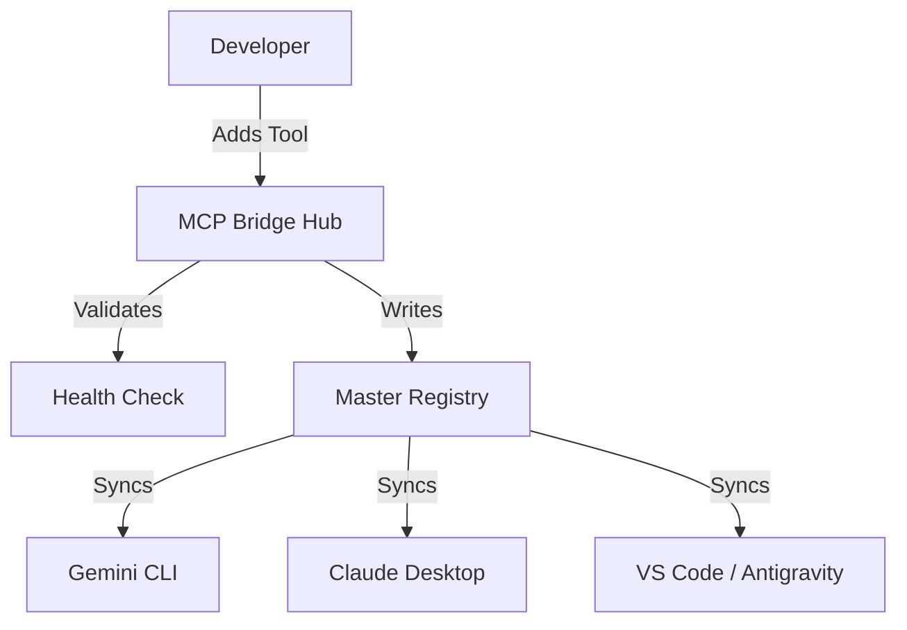

# Universal MCP Bridge: Development Plan

## 1. Executive Summary
**Universal MCP Bridge** (Project Codename: *MCP-Omni*) aims to become the industry-standard configuration manager for the Model Context Protocol ecosystem. As of 2026, AI developers struggle with "configuration sprawl," managing duplicate server definitions across 3-5 different tools. This project centralizes that management into a single "Hub."

## 2. Project Scope

### Phase 1: Consolidation (Completed)
- **Deliverable**: A PowerShell script (`sync-mcp.ps1`) that merges and syncs configurations.
- **Target Users**: Power users on Windows using Gemini CLI, Antigravity, and Roo Code.
- **Status**: Stable & Operational.

### Phase 2: The CLI Tool (In Progress)
- **Deliverable**: A Node.js-based CLI (`mcp-bridge`).
- **Features**:
    - `mcp-bridge init`: Auto-detects installed clients.
    - `mcp-bridge add`: Installs new servers via NPM/Pip/Docker and registers them.
    - `mcp-bridge sync`: Cross-platform sync (Windows/macOS/Linux).
- **Tech Stack**: TypeScript, Node.js, Commander.js, Zod (validation).

### Phase 3: The Service (Q3 2026)
- **Deliverable**: A background daemon.
- **Features**:
    - Real-time file watching (no manual sync needed).
    - System Tray icon for quick status checks.
    - Secure Vault integration for API keys (Windows Credential Manager / macOS Keychain).

### Phase 4: The Cloud Hub (Q4 2026 - Paid Tier)
- **Deliverable**: SaaS Platform.
- **Features**:
    - Sync configurations across devices.
    - "Team Registries" for sharing corporate toolsets.
    - Usage analytics and token cost monitoring.

## 3. Architecture Design

### Core Components
1.  **Registry**: A standardized JSON schema (`.mcp_master.json`) acting as the Single Source of Truth.
2.  **Adapters**: Modules responsible for reading/writing specific client config formats (VS Code, Claude, etc.).
3.  **Engine**: The logic that diffs, merges, and validates server definitions.
4.  **Connectors**: Hooks that integrate with the OS (File Watchers, Keychains).

### Data Flow

## 4. Technology Stack (Phase 2)
- **Runtime**: Node.js (LTS)
- **Language**: TypeScript 5.x
- **CLI Framework**: Oclif or Commander
- **Validation**: Zod
- **File Watching**: Chokidar
- **System Integration**: node-keytar (for secrets)

## 5. Monetization Strategy
- **Community Edition (Open Source / Free)**:
    - Local sync.
    - Basic CLI.
    - Unlimited local servers.
- **Pro Edition ($5/mo)**:
    - Cloud Sync.
    - Encrypted Secret Vault.
    - Priority Support.
- **Enterprise Edition ($20/user/mo)**:
    - Team Registries.
    - SSO / RBAC.
    - Audit Logs.

## 6. Immediate Next Steps
1.  Initialize the Node.js project structure.
2.  Port the `sync-mcp.ps1` logic to TypeScript.
3.  Implement the "Auto-Discovery" module for standard paths.
4.  Release v0.1.0 alpha to internal testing.
